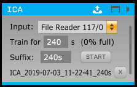
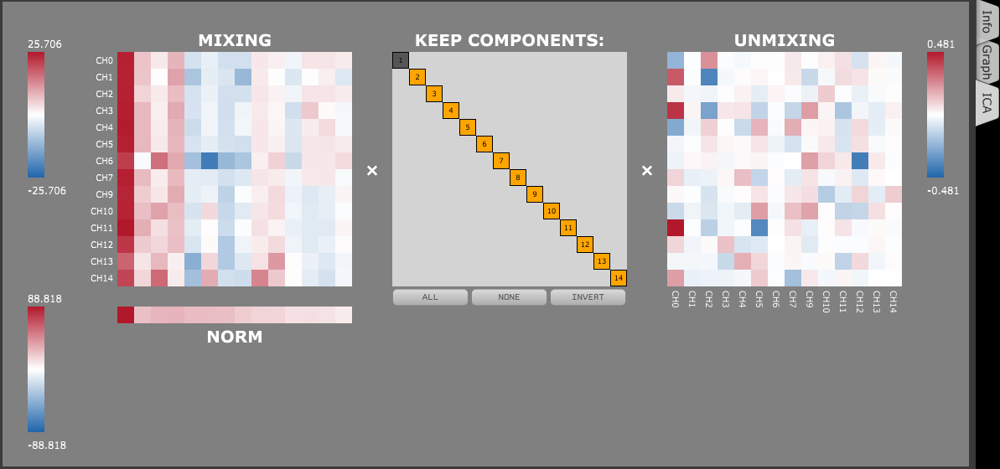

# ICA Plugin

This plugin for the [Open Ephys GUI](http://www.open-ephys.org/gui) allows you to decompose incoming data using ICA, and then exclude specified components. This can be used to reduce common noise, for instance - for more information, see [Whitmore & Lin, "Unmasking local activity within local field potentials (LFPs) by removing distal electrical signals using independent component analysis"](https://linkinghub.elsevier.com/retrieve/pii/S1053811916001415).

**Use this branch if you are building the main GUI and plugins without using CMake. If you have updated your plugin-GUI repository to use CMake for all building (on the development branch as of writing), use the *cmake-gui* branch instead.**

 

## Requirements

### Eigen

This plugin depends on the [Eigen](http://eigen.tuxfamily.org/index.php?title=Main_Page) library for matrix manipulation (version 3.3.x). If you are on Linux or macOS, Eigen should be available through your usual package repository (e.g., the Ubuntu package is called `libeigen3-dev`).

On Windows, follow the following steps:

* From the Eigen website [here](http://eigen.tuxfamily.org/index.php?title=Main_Page), download the latest *stable* release as a ZIP file, and unzip it to somewhere convenient. (You can also clone it from the git mirror, but make sure to checkout a stable version, e.g. 3.3.7, because they use "master" as a development branch.)

* In the Eigen root directory, make a new folder called `build`

* From the `build` folder, run `cmake ..` to install Eigen. You don't have to actually build the generated solution, which will copy some files to your Program Files folder; running CMake registers the location of the header files in CMake's User Package Registry (i.e. the Windows Registry), which is all we need.

  * You might notice some warnings about not being able to find BLAS or LAPACK. They're not required, and since the matrices this plugin deals with are typically small they probably won't make much of a difference, but if you're interested, it is possible to install them and use them with Eigen by following the instructions [here](http://eigen.tuxfamily.org/dox/TopicUsingBlasLapack.html).

### BINICA

The plugin depends on a program called [BINICA](https://sccn.ucsd.edu/wiki/Binica). Since the compilation process seems complex and the precompiled versions are well-tested, just the compiled binaries for each platform are currently included under `/binica`. The following platforms are supported:

* Windows Intel x64
* Linux Intel 32-bit
  * If you are on a 64-bit architecture, you might have to install 32-bit C libraries to run the executable. For instance, on Ubuntu 18.04, I had to do so as follows:
  
    ```
    sudo dpkg --add-architecture i386
    sudo apt-get update
    sudo apt-get install libc6:i386
    ```
* Mac OS Intel 32- or 64-bit
* Mac OS PowerPC 32- or 64-bit

## Installation

First, you must download and build the Open Ephys GUI source - the library it exports is required to build plugins for it. Then, clone this repository in a neighboring folder to the `plugin-GUI` repository and follow these instructions: [Create the build files through CMake](https://open-ephys.atlassian.net/wiki/spaces/OEW/pages/1259110401/Plugin+CMake+Builds).
