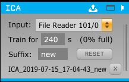

# ICA Plugin

This plugin for the [Open Ephys GUI](http://www.open-ephys.org/gui) allows you to decompose incoming data using ICA, and then extract or exclude specific independent components. One way to utilize this is as a substitute or supplement to referencing to reject common noise - for more information, see [Whitmore & Lin, "Unmasking local activity within local field potentials (LFPs) by removing distal electrical signals using independent component analysis"](https://linkinghub.elsevier.com/retrieve/pii/S1053811916001415).

**Use this branch if you are building the main GUI and plugins without using CMake. If you have updated your plugin-GUI repository to use CMake for all building (on the development branch as of writing), use the *cmake-gui* branch instead.**

 

## Requirements

### Eigen

This plugin depends on the [Eigen](http://eigen.tuxfamily.org/index.php?title=Main_Page) library for matrix manipulation (version 3.3.x). If you are on Linux or macOS, Eigen should be available through your usual package repository (e.g., the Ubuntu package is called `libeigen3-dev`).

On Windows, follow the following steps:

* From the Eigen website [here](http://eigen.tuxfamily.org/index.php?title=Main_Page), download the latest *stable* release as a ZIP file, and unzip it to somewhere convenient. (You can also clone it from the git mirror, but make sure to checkout a stable version, e.g. 3.3.7, because they use "master" as a development branch.)

* In the Eigen root directory, make a new folder called `build`

* From the `build` folder, run `cmake ..` to install Eigen. You don't have to actually build the generated solution, which will copy some files to your Program Files folder; running CMake registers the location of the header files in CMake's User Package Registry (i.e. the Windows Registry), which is all we need.

  * You might notice some warnings about not being able to find BLAS or LAPACK. They're not required, and since the matrices this plugin deals with are typically small they probably won't make much of a difference, but if you're interested, it is possible to install them and use them with Eigen by following the instructions [here](http://eigen.tuxfamily.org/dox/TopicUsingBlasLapack.html).

### BINICA

The plugin depends on a program called [BINICA](https://sccn.ucsd.edu/wiki/Binica). Since the compilation process seems complex and the precompiled versions are well-tested, just the compiled binaries for each platform are currently included under `/binica`. The following platforms are supported:

* Windows Intel x64
* Linux Intel 32-bit
  * If you are on a 64-bit architecture, you might have to install 32-bit C libraries to run the executable. For instance, on Ubuntu 18.04, I had to do so as follows:
  
    ```
    sudo dpkg --add-architecture i386
    sudo apt-get update
    sudo apt-get install libc6:i386
    ```
* Mac OS Intel 32- or 64-bit
* Mac OS PowerPC 32- or 64-bit

## Installation

First, you must download and build the Open Ephys GUI source - the library it exports is required to build plugins for it. Then, clone this repository in a neighboring folder to the `plugin-GUI` repository and follow these instructions: [Create the build files through CMake](https://open-ephys.atlassian.net/wiki/spaces/OEW/pages/1259110401/Plugin+CMake+Builds).

## Usage


When an ICA processor is in the signal chain, it continuously caches the most recent data in an internal buffer. You can choose how much data to collect by changing the training length. It's a good idea to test offline how long of a training data segment produces a good ICA decomposition for your data - for example, in MATLAB you can use FieldTrip's `ft_componentanalysis` function with the 'runica' or 'binica' method, or you can also run this from EEGLAB. The training data is downsampled to a sample rate of approximately 500 Hz.

If you want to start collecting data at a specific point rather than use what is already cached, you can click the "RESET" button to clear the cache.

Once the cache is full, the "START" button will appear. This launches the binica program and begins training. You should be able to see its output on your terminal (a window should pop up if you're running on Windows without a terminal attached). Training time depends mainly on the length of training data; it ends when "wchange" goes below 10^-6.

Once training is done, the name of the directory containing this run's output files appears at the bottom of the editor. This is stored within an "ica" directory in the current recording location. You can load this in later sessions by clicking the load button in the title and finding the "binica.sc" file. As long as there are enough input channels in the selected subprocessor, the same decomposition matrices will be applied to the same channels of the selected input. The mixing and unmixing matrices are also base64-encoded in the XML data when you save a signal chain, so they can be reloaded even if the ICA output has been moved or is otherwise unavailable.

When a decomposition is loaded, heatmaps of the weights in the mixing and unmixing matrices will appear in the canvas window or tab. (See screenshot above.) The output on the included channels is equal to the input left-matrix-multiplied by <code>M&nbsp;*&nbsp;S&nbsp;*&nbsp;U</code>, where M is the mixing matrix, U is the unmixing matrix, and S is a binary selection matrix which is 1 on the diagonal entries that are selected to be kept and 0 everywhere else. (The actual implementation avoids doing multiplications with terms equal to 0.)

To reject certain components, deselect the corresponding buttons in the center "KEEP COMPONENTS" area. Some pointers:

* By default, the first component (which has the highest variance) is rejected.

* With all components selected, the output is the same as the input.

* With none selected, the output is 0 on the channels that are included in the decomposition.

* Selecting just one component has the effect of outputting that component on each included channel, scaled by the component's weight on each channel in the mixing matrix. Thus, this can be used to visualize what you would be rejecting by excluding that component.

* In general, the "INVERT" button is helpful to switch between the signal with noise components rejected and the noise components themselves.

## Caution

While ICA can often separate noise and artifacts from signal better than other methods, it can also easily reduce signal and increase noise. It's important to exclude very noisy or broken channels before running, and if any included channels start looking very different after ICA has been trained (especially if they become more noisy), the decomposition will no longer be a good fit to the distribution of data and will probably spread any new noise to all the channels. In this case, noisy channels should be excluded and ICA re-run. (Of course, you would do the same thing if you were using an ordinary common average ref. The difference is that retraining ICA might take a while, so it's important to try to exclude the right channels the first time.)
